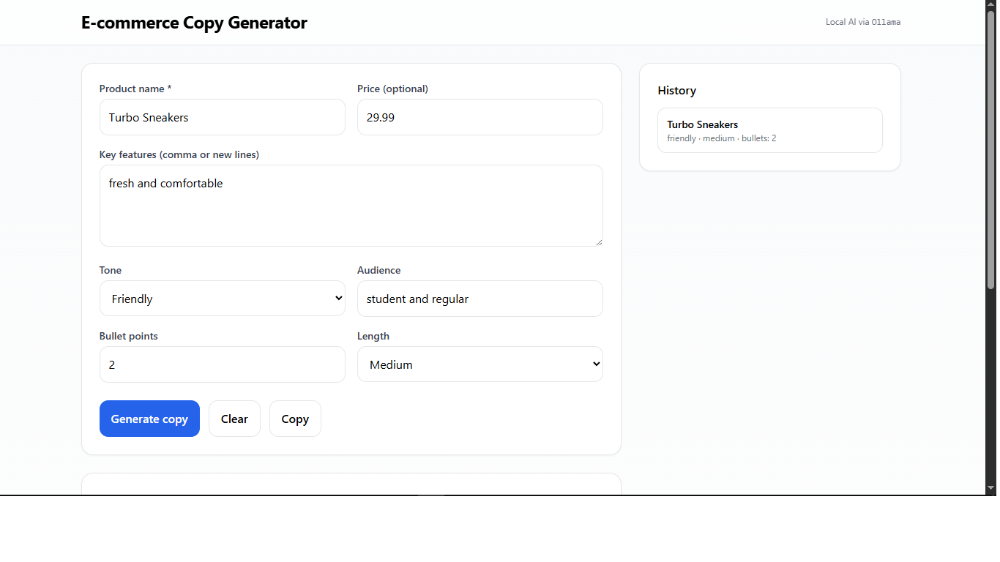
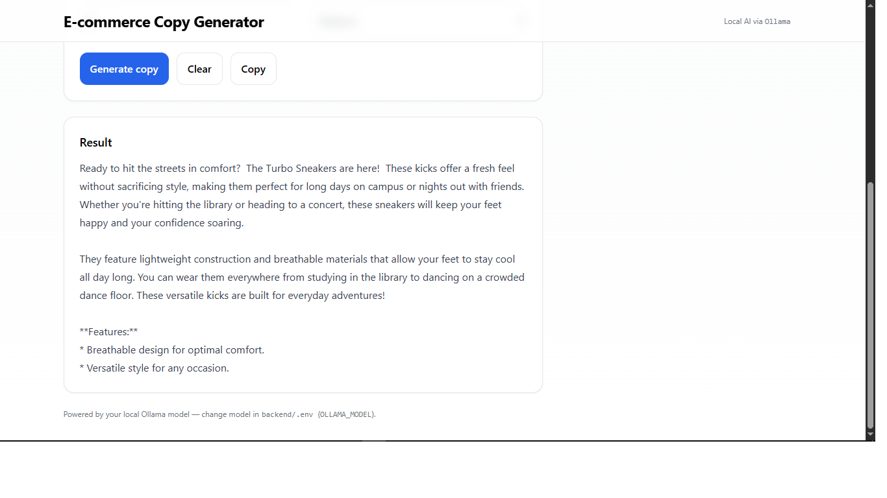

# AI E-commerce Copy Generator

A simple web app that generates product descriptions using AI.  
Built with **React + TailwindCSS** (frontend) and **Django REST Framework** (backend).  
Runs locally with **Ollama** (no API key required).

---

## 📸 Screenshot

---

## ⚙️ Tech Stack
- Frontend: React (Vite), TailwindCSS  
- Backend: Django, DRF  
- AI Runtime: Ollama (gemma2:2b model)

---

## ✨ Features
- Input product details (name, price, features, tone, etc.)  
- Generate marketing copy with AI  
- Copy, clear, and view history of generated results  
